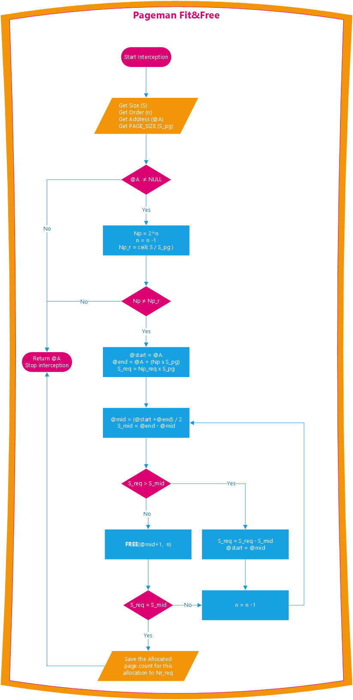
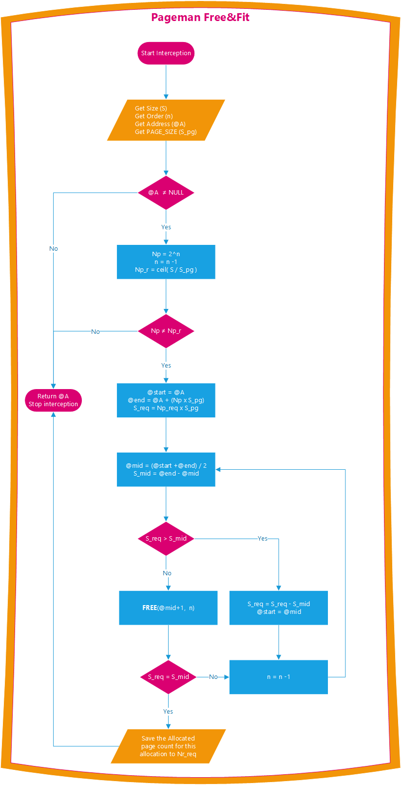
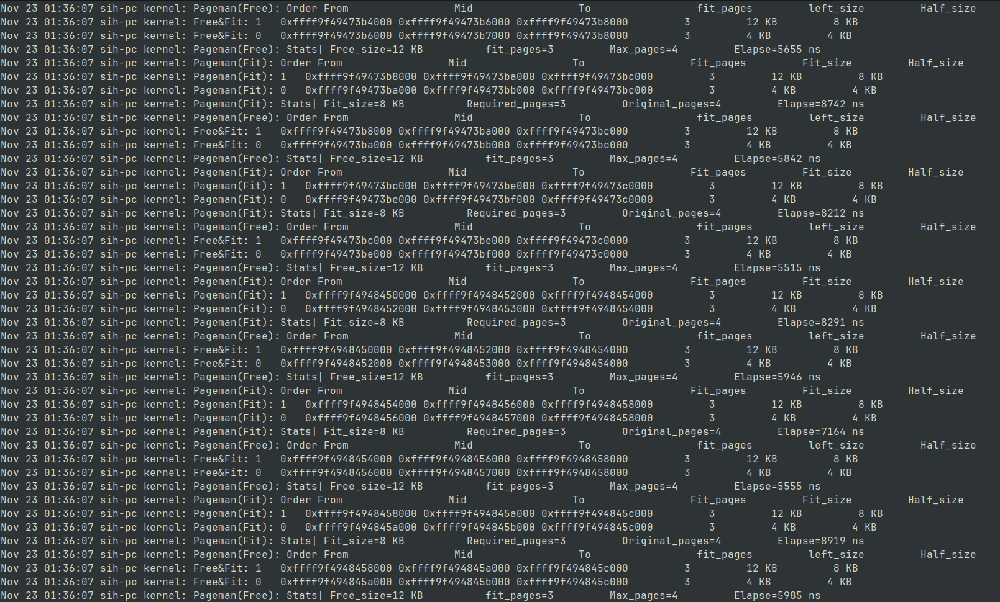
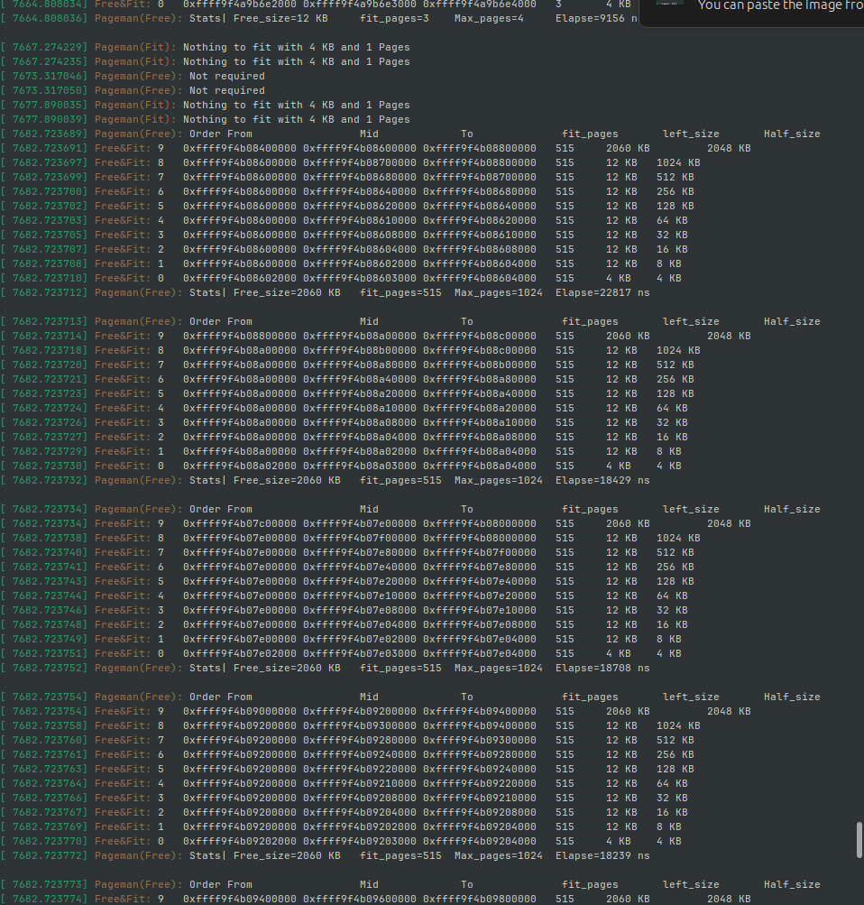
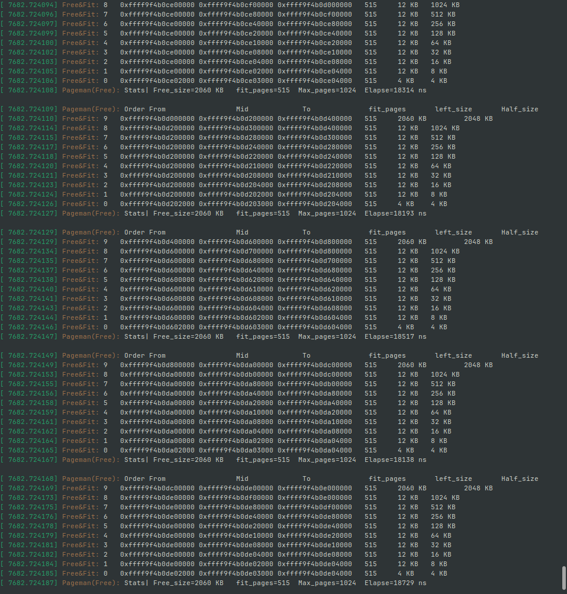
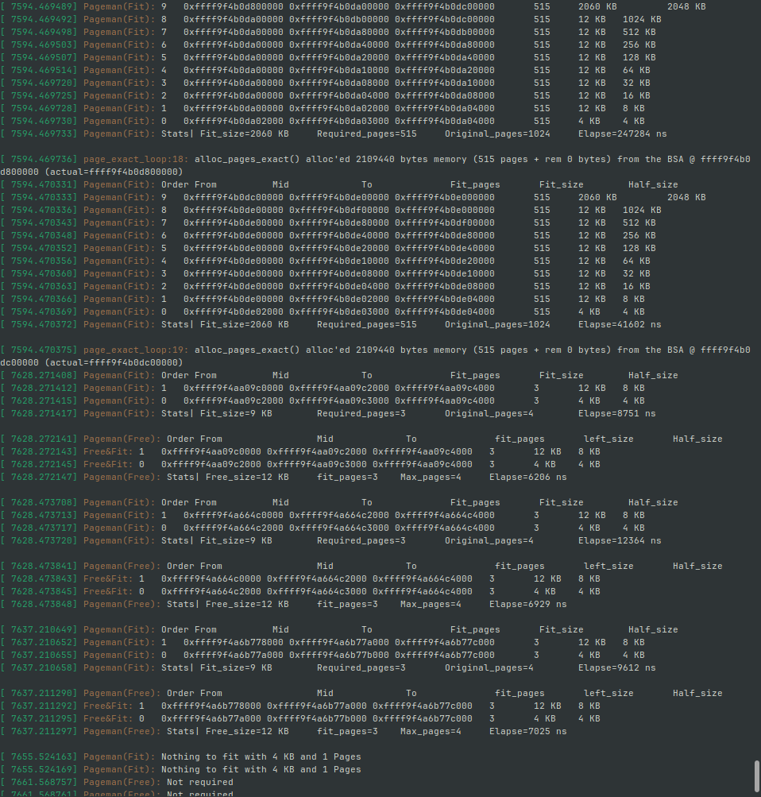
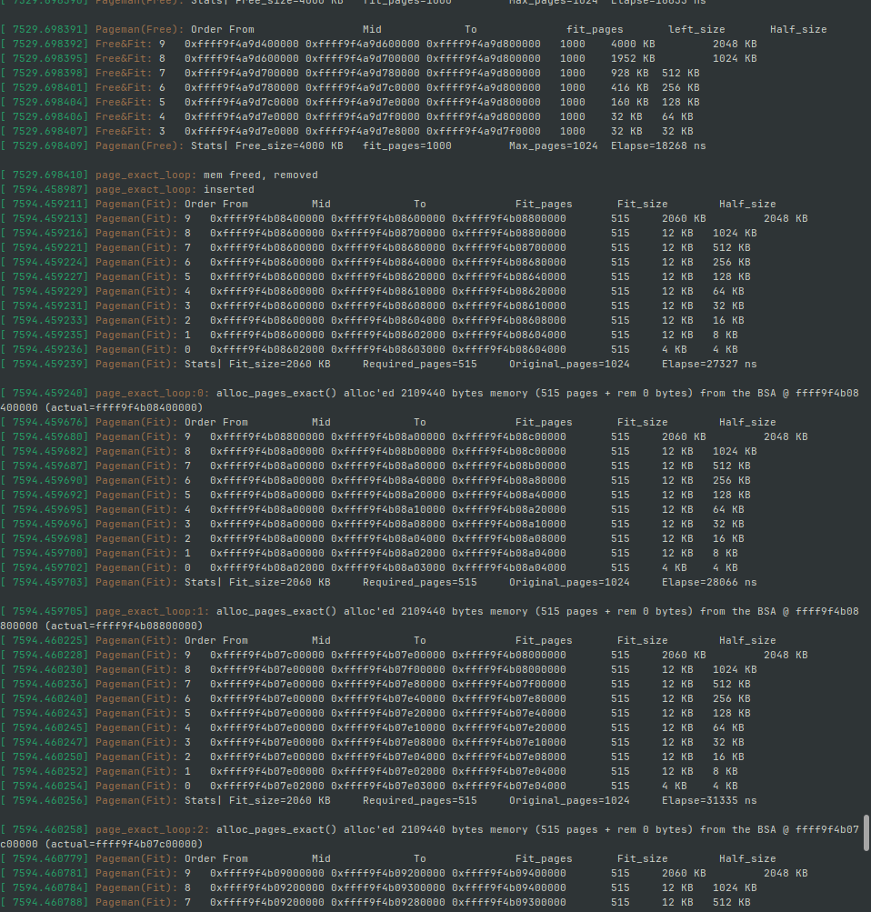
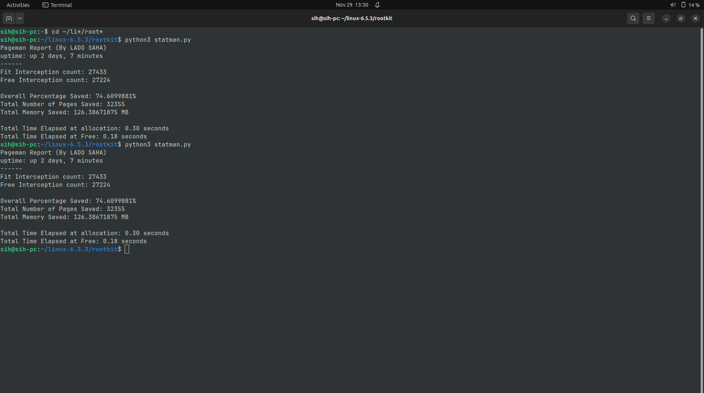

# Linux Memory Manager `Pageman`

| Project Title | Linux Memory Manager |
|---------------|----------------------|
| Name          | LADO SAHA            |
| ID            | 21P296               |
| Class         | 3GI                  |
| Subject       | Operating System     |
| Teacher Name  | Pr. Djiotio          |
| Date          | 23 Nov 2023          |

## Table of Contents

<!-- TOC -->

* [Linux Memory Manager `Pageman`](#linux-memory-manager-pageman)
    * [Table of Contents](#table-of-contents)
    * [Abstract](#abstract)
    * [Introduction](#introduction)
    * [Methodology](#methodology)
    * [Implementation](#implementation)
        * [0. Prerequisites](#0-prerequisites)
        * [1. Building a Linux kernel from source](#1-building-a-linux-kernel-from-source)
        * [3. Setting up the Editing environment](#3-setting-up-the-editing-environment)
        * [4. Tweaking the kernel memory manager source code](#4-tweaking-the-kernel-memory-manager-source-code)
        * [5. Booting from our kernel](#5-booting-from-our-kernel)
        * [6. Implementing the Pageman Module](#6-implementing-the-pageman-module)
        * [7. Inserting and running Pageman](#7-inserting-and-running-pageman)
    * [Results](#results)
    * [Evaluation](#evaluation)
    * [Conclusion](#conclusion)
    * [Articles & Resources](#articles--resources)

<!-- TOC -->

## Abstract

This report introduces **Pageman**, a memory manager designed for Linux systems. Pageman addresses a
problem in the freelist buddy allocator used for physical page allocation. The allocator's
predefined block sizes create difficulties when allocating memory blocks that don't fit into these
sizes, particularly for low-level programs like device drivers and kernel internals which donot have
the luxury of relying on virtual contiguous pages.

Existing solutions attempt to reduce fragmentation by trimming allocated blocks and freeing excess
memory to a lower order. However, this approach leads to the complete splitting of larger memory
blocks over time, making it challenging to allocate higher order contiguous blocks overtime.

In contrast, Pageman offers a novel solution that strikes a balance between reducing fragmentation
and preserving higher-order contiguous blocks. By intelligently trimming allocated blocks and
retaining unused memory blocks, Pageman improves memory utilization without sacrificing the
availability of larger contiguous allocations.

Implemented within the Linux kernel, Pageman has been extensively evaluated and demonstrates its
effectiveness in mitigating fragmentation while supporting larger contiguous allocations.

Overall, Pageman provides an enhanced memory management solution for Linux systems. By optimizing
memory allocation, it improves system memory management and offers valuable insights for memory
management in low-level programs and kernel internals.

## Introduction

Memory management is a critical aspect of operating systems, and the Linux operating system employs
a sophisticated memory management subsystem known as the Linux Memory Manager (Linux MM) to
efficiently handle memory allocation and reallocation. Within Linux MM, various memory allocation
techniques are utilized to optimize memory utilization and system performance.

One prominent memory allocation technique utilized in Linux is the freelist buddy allocator. This
allocator organizes memory into fixed-size blocks and maintains a freelist structure containing
linked lists of contiguous memory blocks. However, an inherent challenge faced by the freelist buddy
allocator is the issue of internal fragmentation. Internal fragmentation occurs when allocated
memory blocks are larger than the requested size, resulting in wasted memory within the blocks and
decreased overall memory utilization efficiency.

To mitigate the problem of internal fragmentation, Linux incorporates another memory allocator known
as the slab allocator. The slab allocator focuses on the efficient management of small,
variable-sized objects by grouping them into caches. By allocating memory in fixed-sized slabs
tailored to the object size, the slab allocator reduces internal fragmentation and minimizes wasted
memory. However, the slab allocator does have limitations when it comes to allocating large
contiguous blocks of memory.

In 2008, an patch was made to address the allocation of large contiguous blocks through the
introduction of the `alloc_page_exact` solution in the page allocator API. However, this solution
inadvertently resulted in a problem where large blocks that did not fit into individual pages were
broken, leading to a scarcity of large contiguous blocks over time. This scarcity poses challenges
for applications and low-level programs that require such memory regions.

The current problem we aim to address in this report is finding a balance between reducing internal
fragmentation without significantly increasing the scarcity of large contiguous blocks. It is
crucial to optimize memory utilization and system performance by minimizing wasted memory while
still ensuring the availability of larger contiguous memory regions.

Throughout this report, we will delve into the concepts of the freelist buddy allocator, the slab
allocator, the challenges introduced by the alloc_page_exact solution, and the trade-offs between
reducing internal fragmentation and the scarcity of large contiguous blocks. By addressing these
challenges, our goal is to enhance memory management in Linux, improving overall system performance
and efficiency.

The subsequent sections of this report will provide a detailed analysis of the freelist buddy
allocator, the slab allocator, the implications of the alloc_page_exact solution, and propose
strategies for mitigating internal fragmentation while preserving the availability of large
contiguous memory blocks. Through this research, we aim to contribute to the advancement of memory
management techniques in Linux, benefiting a wide range of applications, low-level programs, and
overall system performance.

## Methodology

At its core, Pageman is a memory manger in the sense that it does not do the allocation but just
manages the allocations. It instead sits over the Buddy allocator and intercepts any allocation of
pages which can be trimmed or fitted. In a similar manner, when it detects any block previously
fitted requesting to be freed, it intervenes to free it in an orderly manner to different orders in
the freelist.

Pageman uses two pretty similar algorithms which are the **Fit&Free** during the allocation and the
**Free&Fit** during the free stage. To better understand, we will place ourselves in a general
scenario. Before we proceed, we need to define some variables and functions which we will be used
below.

| variable               | Full Name                | Type    | Meaning                                                                              |
|------------------------|--------------------------|---------|--------------------------------------------------------------------------------------|
| S                      | Size                     | Integer | It represents the size in Bytes of the requested allocation                          |
| n                      | Order                    | Integer | It represents the nearest power of 2 for which is greater than or equals to the size |
| @A                     | Address                  | Pointer | It represents the address of the start of the allocated block                        |
| S_pg                   | Size of a RAM PAGE       | Number  | This is the size of a RAM page                                                       |
| Np                     | Total Number of pages    | Number  | This refers to the 2^n or the number of pages which were allocated                   |
| by the buddy allocator |                          |         |                                                                                      |
| Np_req (or Np_r)       | Number of Required Pages | Number  | This refers to the minimum amount of pages to fit                                    |
| the allocation size    |                          |         |                                                                                      |
| S_req                  | Required Size            | Number  | This is the Size of the block minimum the amount of page required                    |
| S_mid                  | Half size span           | Number  | This is half of the size of block                                                    |

| Function | Argument1   | Argument2                                              | Use                                                              |
|----------|-------------|--------------------------------------------------------|------------------------------------------------------------------|
| ceil     | Real Number | Returns the smallest integer greater than the argument |
| FREE     | Pointer     | Order                                                  | Frees from the address given to a freelist at a particular order |

A call to the `alloc_pages_exact`, `alloc_pages_exact`, `__kmalloc_large_node` from the kernel
subsystems i.e all page allocation apis which takes in a size as parameter. We proceed as follows.



- We can note that we continually half the allocated block till while freeing the unused blocks to
  their ideal order till we are left with a number of pages which can be allocated
- If the minimum number of pages is equals to the allocated number, we donot do anything.

Analogously, any call to `free_pages_exact`, `kfree` from the kernel subsystems i.e Any page freeing
APIs, we first check if we trimmed the blocked to be freed and in that case, we launch the Free&Fit
algorithm as shown below.



- We can note that we half the allocated space and free it to its ideal order until we are done

Here we reach the end of this rather short introduction and finally talk about the implementation of
the whole system.

## Implementation

The implementation was done on a linux machine with the following specs

| Computer         | Lenovo Thinkpad T459s            |
|------------------|----------------------------------|
| Firmware version | N1CET89W (1.57)                  |
| Memory           | 12.0GiB                          |
| Processor        | Intel® Core™ i7-6600U × 4        |
| Graphics         | Intel® HD Graphics 520 (SKL GT2) |
| Disk Capacity    | 2TB                              |
| Linux Distro     | Ubuntu 23.04                     |
| OS Type          | 64-bit                           |
| Kernel Version   | Linux 6.2.0-20-generic           |

The project was carried out on a custom built **linux kernel version 6.5.3.**

### 0. Prerequisites

The following steps were carried out to setup the system

```bash
# The following libraries were installed during the setup process

# Updating the system libraries
sudo update
sudo upgrade

# Installing linux headers for compilation
sudo apt install build-essential dkms linux-headers-$(uname -r)

# Installing C, git, make and perl
sudo apt install git gcc make perl 

# Additional libraries for compilation
sudo apt-get install libncurses-dev flex bison openssl libssl-dev dkms libelf-dev libudev-dev libpci-dev libiberty-dev autoconf
sudo apt install dwarves
```

### 1. Building a Linux kernel from source

- Download and extraction of the kernel

```bash
# Changing to the home directory and creating our working directory manager
cd ~
mkdir manager 
cd manager

# Download the kernel archive file
wget https://cdn.kernel.org/pub/linux/kernel/v6.x/linux-6.5.3.tar.xz

# Extract the extraction 
tar -xf manager/linux-6.5.3.tar.xz

# Navigating to the kernel code 
cd manager/linux-6.5.3
```

- Building the kernel image and modules

```bash
# Copying the current system modules in an attempt to build a clone
sudo lsmod > /tmp/lsmod.now

# After putting our terminal in fullscreen, we edit the configuration of our kernel 
make menuconfig
```

The last command opens a minimalist menu driven interface to tweak some of the kernel
configurations.

______________________________________________________________________

NB: The following keys are used in the menuconfig (non exhaustive)

| Keyboard Key | Meaning                 | Visual Effect                           |
|--------------|-------------------------|-----------------------------------------|
| y            | Enable                  | *                                       |
| n            | Disable                 | n                                       |
| m            | Enable as module        | m                                       |
| Esc(x2)      | Navigate back           |
| Up, Down     | Scroll Up, Down         |
| Left, Right  | Navigate about the menu | Highlights the Exit, Save, Load options |

The table below contains the different configurations which were done to the kernel

| Feature                              | Info                                                                     | Path in menu                                                                                     | Precise config option    | New value |
|--------------------------------------|--------------------------------------------------------------------------|--------------------------------------------------------------------------------------------------|--------------------------|-----------|
| Kernel config Support                | Allows us to see the current kernel config details                       | General Setup/ Kernel .config support                                                            | CONFIG_IKCONFIG          | y         |
|                                      | Allows us to see current kernel configuration details via the **procfs** | General Setup/ Enable access to .config through the /proc/config.gz                              | CONFIG_IKCONFIG_PROC     | n         |
| Kernel profiling                     | Kernel profiling support                                                 | General Setup / Profiling support                                                                | CONFIG_PROFILING         | n         |
| HAM RADIO                            | Support for the HAM radio                                                | Networking support/ Amateur Radio support                                                        | CONFIG_HAMRAIO           | y         |
| Userspace IO                         | UIO support                                                              | Device Drivers / Userspace I/O Drivers                                                           | CONFIG_UIO               | m         |
|                                      | UIO platform driver with generic IRQ(Interrupt handler Request) handling | Device Drivers / Userspace I/O Drivers / Userspace I/O platform driver with generic IRQ handling | CONFIG_UIO_PDRV_GENIRQ   | m         |
| MS-DOS filesystem support            | Mount NTFS drives                                                        | File systems / DOS/FAT/NT Filesystems / MSDOS fs support                                         | CONFIG_MSDOS_FS          | m         |
| Security LSMs                        | Turn off kernel LSMs (Not safe for production environments)              | Security options / Enable different security models                                              | CONFIG_SECURITY          | n         |
| Kernel debug: stack utilization info | Have full debug info about the memory                                    | Kernel hacking / Memory Debugging / Stack utilization instrumentation                            | CONFIG_DEBUG_STACK-USAGE | y         |

- After applying all the configuration above we saved and left the menu. We then processed by
  disabling some securities and were finally ready to build the kernel. Th e building process took
  45 minutes and was very CPU and memory Intensive

- After applying all the configuration above we saved and left the menu. We then processed by
  disabling some securities and were finally ready to build the kernel. Th e building process took
  45 minutes and was very CPU and memory Intensive

> **Warning:** Any interruption like sleeping or shutdown during the compilation process may lead to
> a complete corruption of the current system GUI and internal components . Thus we made sure our
> computer could not sleep and was well powered.

```bash
# ~/manger/linux-6.5.3
# Disabling some debian specific security keys 
sudo scripts/config --disable SYSTEM_REVOCATION_KEYS
sudo scripts/config --disable SYSTEM_TRUSTED_KEYS

# Building the kernel and specifying the modules to install 
# For parallel compilations, we used -j4 which allocates 4 cores 
make LSMOD=/tmp/lsmod.now localmodconfig -j4
```

### 3. Setting up the Editing environment

- We used the [neovim](https://github.com/neovim/neovim/wiki/Installing-Neovim#linux) editor. The
  basic installation was done using the following commands.

```bash
# Navigate to the home directory
cd ~
# Installing the neovim image
curl -LO https://github.com/neovim/neovim/releases/latest/download/nvim.appimage
# Giving the permissions 
chmod u+x nvim.appimage
./nvim.appimage
#
# if the ./nvim.appimage fails, we can try
./nvim.appimage --appimage-extract
./squashfs-root/AppRun --version

# Optional: exposing nvim globally.
sudo mv squashfs-root /
sudo ln -s /squashfs-root/AppRun /usr/bin/nvim

# Finally, we can run the editor using the command below from any where
nvim
```

After installing neovim, some setup process was needed to make it suitable for editing C code, and
the resource below was of great help

[The perfect Neovim Setup for C++](https://www.youtube.com/watch?v=lsFoZIg-oDs)

> Another option could have been the Code
> editor [vscode](https://code.visualstudio.com/docs/setup/linux). In that case, we could have
> installed the C/C++ extensions from Microsoft and the Linux Kernel extensions.

- After setting up the code editor for vanilla C code, we had make sure it understood we were
  dealing with Linux kernel code and could include Kernel header files. This was done beacuse the
  linux kernel does not use the standard gcc library. The setup was as follows.

>
The [StackOverflow thread](https://stackoverflow.com/questions/33676829/vim-configuration-for-linux-kernel-development)
was of great help

```bash
# Navigate to the kernel code 
cd ~/manager/linux-6.5.3 

# Required for code editor to navigate through the kernel code 
sudo apt install cscope exuberant-ctags

# Creating an index database for easy navigation and code intelisense 
# We index only indexed the x86_64 architecture directories since we had no need for cross
 platform and our computer was an x86 64bit computer 
make O=. ARCH=x86_64 COMPILED_SOURCE=1 cscope tags

# Next, we generated the following json file to inform our editor about some compiling options.
python3 scripts/clang-tools/gen_compile_commands.py
```

> NB: Even though we didn't use vscode, we found the
> resource [vscode for kernel dev](https://github.com/neilchennc/vscode-linux-kernel) potentially
> helpful. It mainly consists in editing
> the `c_cpp_properties.json`, `settings.json`, `tasks.json`, `.vscode/` to recognise the kernel
> header files

### 4. Tweaking the kernel memory manager source code

> This section was done with a lot of precaution since any error could make the compilation fail. We
> made sure to carefully add some functions and global variables necessary for the wee functioning
> of `Pageman`.

- Overall the, the following kernel files were modified
    - `~/manager/linux-6.5.3/include/linux/gfp.h`
    - `~/manager/linux-6.5.3/mm/page_alloc.c`
    - `~/manager/linux-6.5.3/mm/slab_common.c`
    - `~/manager/linux-6.5.3/kernel/kallsyms.c`

For each file, we did specific changes as shown below

- `gfp.h` File additions

```c
/* Added fter line 157 in gfp.h*/

/**
 * A global tracker to know if pageman has been loaded or not 
 * Becomes true when pageman is loaded and false when unloaded  
 */
extern bool is_pageman_loaded;
/**
 * A global variables that holds the value of the start of the virtual first page of an allocated or to be deallocated block.
 * When ever an allocation or deallocation is intercepted, we save the this address.
 * NB: This address is a the virtual adddress to the page and not the page address
 */
extern unsigned long gb_start_address;
/**
 * Another global variable that holds the order of an allocated request to the BuddyAllocator
 * Varies from 0 to MAX_ORDER(generally 11).
 */
extern unsigned int gb_order;
/**
 * Another global variable that holds the size in Bytes of an allocation request 
 */
extern size_t gb_size;
/**
 * The size of this array is ideally equals to the total numbers of pages in our RAM. This size is calculated by 
 * dividing the RAM size by the size of a page. 
 * e.g array size for 16GB = (16 * 1024 * 1024 KB)/(4096 KB), assuming our pages are 4KB large.  
 * Since we cannot know the this at compile time, we must set assume a large enough value.
 *
 * In practice, this array stores the number of pages that were allocated for each allocation, which permits us 
 * durring deallocation to know the number of pages which were allocated. The index is the page frame number associated to 
 * start_address of the allocation block and it is initialized to zeroes at compile time 
 *
 * (Warning) There are limits to the size of this array above which the compilation will fail.
 */
extern unsigned long pages_metadata_table[3145728];
/**
 * This is a helper function called by the allocators to set the global variables 
 */
void fit_and_free_injector(unsigned long page_start_addr, unsigned int order, size_t size);
/**
 * This is a helper function called by the deallocators to set the start_address of the block to be deallocated
 */
void free_and_fit_injector(unsigned long page_start_addr);
/**
 * A helper function to know if a page has been allocated by checking if its page frame number(pfn) has a non zero 
 * value in the array 
 *
 * Returns 0 if the page is not currently being allocated
 * Returns 1 if the page is currently in use or has not been deallocated 
 */
extern int get_nr_pages_metadata(struct page *page);
/**
 * A helper function to set the number of pages allocated with by a block starting at that pfn 
 * In summary for a given page, it gets the pfn and uses it as an index to set the number of pages allocated 
 */
extern void set_nr_pages_metadata(struct page *page, unsigned short nr_pages);

/* 
 * We make the original make_alloc_exact function to become an `extern function` to avoid double declaration
 * We also must change the definition of this function in the file
 */
extern void *make_alloc_exact(unsigned long addr, unsigned int order,
			      size_t size);
....
```

- `page_alloc.c` File modifications

Definitions of the global variables and functions defined in gfp.h

```c
...

/* In page_alloc.c after line 394 */

bool is_pageman_loaded = false;
unsigned long gb_start_address = 0;
unsigned int gb_order = 0;
size_t gb_size = 0;
unsigned long pages_metadata_table[3145728] = { 0 };
void fit_and_free_injector(unsigned long page_start_addr, unsigned int order, size_t size)
{
	gb_start_address = page_start_addr;
	gb_size = size;
	gb_order = order;
}

void free_and_fit_injector(unsigned long page_start_addr)
{
	gb_start_address = page_start_addr;
}

int get_nr_pages_metadata(struct page *page)
{
	unsigned long pfn = page_to_pfn(page);
	return pages_metadata_table[pfn];
}

void set_nr_pages_metadata(struct page *page, unsigned short nr_pages)
{
	unsigned long pfn = page_to_pfn(page);
	pages_metadata_table[pfn] = nr_pages;
}


/**
 *Finally, we need to all of the above to make them visible to the out of tree build i.e Modules 
 */
EXPORT_SYMBOL(is_pageman_loaded);
EXPORT_SYMBOL(gb_start_address);
EXPORT_SYMBOL(gb_order);
EXPORT_SYMBOL(gb_size);
EXPORT_SYMBOL(get_nr_pages_metadata);
EXPORT_SYMBOL(set_nr_pages_metadata);
EXPORT_SYMBOL(pages_metadata_table);
 ....
```

Modification of the `alloc_pages_exact` definition at around line 4791

```c
/* In page_alloc.c */
....
/**
 * alloc_pages_exact - allocate an exact number physically-contiguous pages.
 * @size: the number of bytes to allocate
 * @gfp_mask: GFP flags for the allocation, must not contain __GFP_COMP
 *
 * This function is similar to alloc_pages(), except that it allocates the
 * minimum number of pages to satisfy the request.  alloc_pages() can only
 * allocate memory in power-of-two pages.
 *
 * This function is also limited by MAX_ORDER.
 *
 * Memory allocated by this function must be released by free_pages_exact().
 *
 * Return: pointer to the allocated area or %NULL in case of error.
 */
void *alloc_pages_exact(size_t size, gfp_t gfp_mask)
{
	unsigned int order = get_order(size);
	unsigned long addr;

	if (WARN_ON_ONCE(gfp_mask & (__GFP_COMP | __GFP_HIGHMEM)))
		gfp_mask &= ~(__GFP_COMP | __GFP_HIGHMEM);

	addr = __get_free_pages(gfp_mask, order);

	/*
   * New 
   * We check if the pageman module is loaded before setting the global variables 
   */
	if (is_pageman_loaded) {
		fit_and_free_injector((unsigned long)addr, order, size);
	}
	/* End */

	return make_alloc_exact(addr, order, size);
}
....
```

Modification of the `alloc_pages_exact_nid` definition at around line 4791

```c
/* In page_alloc.c*/
....
/**
 * alloc_pages_exact_nid - allocate an exact number of physically-contiguous
 *			   pages on a node.
 * @nid: the preferred node ID where memory should be allocated
 * @size: the number of bytes to allocate
 * @gfp_mask: GFP flags for the allocation, must not contain __GFP_COMP
 *
 * Like alloc_pages_exact(), but try to allocate on node nid first before falling
 * back.
 *
 * Return: pointer to the allocated area or %NULL in case of error.
 */
void *__meminit alloc_pages_exact_nid(int nid, size_t size, gfp_t gfp_mask)
{
	unsigned int order = get_order(size);
	struct page *p;

	if (WARN_ON_ONCE(gfp_mask & (__GFP_COMP | __GFP_HIGHMEM)))
		gfp_mask &= ~(__GFP_COMP | __GFP_HIGHMEM);

	p = alloc_pages_node(nid, gfp_mask, order);
	if (!p)
		return NULL;

	/*
   * New 
   * We check if the pageman module is loaded before setting the global variables 
   */
	if (is_pageman_loaded) {
		fit_and_free_injector((unsigned long)page_address(p), order,
				      size);
	}
	/* End */

	return make_alloc_exact((unsigned long)page_address(p), order, size);
}

....
```

Modification of the `free_pages_exact` definition around line 4849

```c
/* In page_alloc.c */
....

/**
 * free_pages_exact - release memory allocated via alloc_pages_exact()
 * @virt: the value returned by alloc_pages_exact.
 * @size: size of allocation, same value as passed to alloc_pages_exact().
 *
 * Release the memory allocated by a previous call to alloc_pages_exact.
 */
void free_pages_exact(void *virt, size_t size)
{
  /**
   * New 
   * We check if this pageman is loaded and that this allocation was initially done by pageman 
   * other wise, we leave the default behavior 
   */
	if (is_pageman_loaded &&
	    get_nr_pages_metadata(virt_to_page(virt)) != 0) {
		free_and_fit_injector((unsigned long)virt);
	} else {
    /* End */
		unsigned long addr = (unsigned long)virt;
		unsigned long end = addr + PAGE_ALIGN(size);

		while (addr < end) {
			free_page(addr);
			addr += PAGE_SIZE;
		}
	}
}
....
```

- Remove the static keyword from `make_alloc_exact` definition around line 4575

```C
/* In page_alloc.c around line 4575 */

/**
 * We just made the make_alloc_exact to become an extern function to avoid double definition
 */
void *make_alloc_exact(unsigned long addr, unsigned int order,
		size_t size)
{
	if (addr) {
		unsigned long nr = DIV_ROUND_UP(size, PAGE_SIZE);
		struct page *page = virt_to_page((void *)addr);
		struct page *last = page + nr;

		split_page_owner(page, 1 << order);
		split_page_memcg(page, 1 << order);
		while (page < --last)
			set_page_refcounted(last);

		last = page + (1UL << order);
		for (page += nr; page < last; page++)
			__free_pages_ok(page, 0, FPI_TO_TAIL);
	}
	return (void *)addr;
}
```

- `slab_common.c` Modifications
  Firstly we modify the `__kmalloc_large_node`(after line 1116) which is called when the allocation
  size of `kmalloc` is too large for any pre-allocated slab.

```c
/* In slab_common.c File after 1116*/
/*
 * To avoid unnecessary overhead, we pass through large allocation requests
 * directly to the page allocator. We use __GFP_COMP, because we will need to
 * know the allocation order to free the pages properly in kfree.
 */

static void *__kmalloc_large_node(size_t size, gfp_t flags, int node)
{
	struct page *page;
	void *ptr = NULL;
	unsigned int order = get_order(size);

	if (unlikely(flags & GFP_SLAB_BUG_MASK))
		flags = kmalloc_fix_flags(flags);

	flags |= __GFP_COMP;
	page = alloc_pages_node(node, flags, order);
	if (page) {
		ptr = page_address(page);
		/**
     * New 
     * We first check if pageman is loaded, next we make sure the allocation size
	  is not a power of 2 (This is the ideal case)
     * FInally, we make sure the size allocated is not more than the buddy allocator
	  can handle 
     * In case everything is ok, we set the global variables and launch the make_alloc_exact 
	 function which will later be intercepted by 
     * pageman and Fit the number of pages
     *
     * Else, we use the default behavior ...
     */
		if (is_pageman_loaded &&
		    DIV_ROUND_UP(size, PAGE_SIZE) != 1 << order &&
		    size < (1 << MAX_ORDER) * PAGE_SIZE) {
			fit_and_free_injector((unsigned long)ptr, order, size);
			return make_alloc_exact((unsigned long)ptr, order,
						size);
		}
		/** End **/
		mod_lruvec_page_state(page, NR_SLAB_UNRECLAIMABLE_B,
				      PAGE_SIZE << order);
	}

	ptr = kasan_kmalloc_large(ptr, size, flags);
	/* As ptr might get tagged, call kmemleak hook after KASAN. */
	kmemleak_alloc(ptr, size, 1, flags);
	kmsan_kmalloc_large(ptr, size, flags);

	return ptr;
}
```

Next, we edit the `kmalloc_large`(after line) and `kmalloc_large_node` allocators wrappers to know
how to trace the allocations by setting the pages actually allocated in case pageman was active

```c
/* In slab_common.c after line 1158 */

void *kmalloc_large(size_t size, gfp_t flags)
{
	void *ret = __kmalloc_large_node(size, flags, NUMA_NO_NODE);

	/** New: 0 if the allocation failed*/
	unsigned long nr_pages = get_nr_pages_metadata(virt_to_page(ret));

	/**
   * New 
   * In case pageman is loaded and the allocation was successfull, we instead trace the  nr_pages actually allocted 
   */
	if (is_pageman_loaded && nr_pages != 0) {
		trace_kmalloc(_RET_IP_, ret, size, nr_pages, flags,
			      NUMA_NO_NODE);
		/*End*/
	} else {
		trace_kmalloc(_RET_IP_, ret, size, PAGE_SIZE << get_order(size),
			      flags, NUMA_NO_NODE);
	}
	return ret;
}
...

```

```c
/** In slab_common.c */

void *kmalloc_large_node(size_t size, gfp_t flags, int node)
{
	void *ret = __kmalloc_large_node(size, flags, NUMA_NO_NODE);

	/** New: 0 if the allocation failed*/
	unsigned long nr_pages = get_nr_pages_metadata(virt_to_page(ret));
	/**
   * New 
   * In case pageman is loaded and the allocation was successfull, we instead trace the nr_pages actually allocted 
   */

	if (is_pageman_loaded && nr_pages != 0) {
		trace_kmalloc(_RET_IP_, ret, size, nr_pages, flags, node);
	/*End*/
	} else {
		trace_kmalloc(_RET_IP_, ret, size, PAGE_SIZE << get_order(size),
			      flags, node);
	}

	return ret;
}
```

- Modifications in the `kallsyms.c`

```C 
/** After line Line 303 */ 
.....
/**
* We add the following lines to expose these 2 API which gives us the possibility to look up any function name from memory and intercept its address */ 

EXPORT_SYMBOL_GPL(kallsyms_lookup_name);
EXPORT_SYMBOL_GPL(kallsyms_on_each_symbol);
.....

```

> That marked the end of the modifications in the kernel code. In Summary, introduce hooking points
> and state savers in the kernel code. All this was in order to make our module function well.

### 5. Booting from our kernel

- After editing our kernel source files, we were required to boot from it before implementing our
  module.

> It was noted that after running the commands below, the system booted automatically from our own
> kernel. This was confirmed by using `uname -r` command.

```bash
# In ~/manager/linux-6.5.3/ 
# We rebuilt the kernel 
make -j4

# After building the kernel, we build the modules which we once copied to /tmp/lsmod.now
sudo make modules_install

# Finally, we tell the system to boot with the new kernel 
sudo make install

# Editing the grub timeout time 
cd /etc/default/
# Opening the grub file and increasing the GRUB_TIMEOUT to 5 using nano, vim or any othe editor
nano grub 

# After closing and saving our work, we rebooted
sudo reboot
```

- When the PC failed to reboot, we navigated through the grub menu advanced options to choose the
  previous kernel.
  Otherwise, we were ready to implemented the Pageman

### 6. Implementing the Pageman Module

As stated before, the the main purpose of the pageman module is to intercept all allocations which
makes a call to the `make_alloc_exact`(found in `~/manager/linux-6.5.3/mm/page_alloc.c`) and all
deallocations which makes a call to `free_pages_exact` which are the APIs we modified in above.
After a call is make to the `make_alloc_exact`, we intercept it and use the global varibles to Fit
the allocation or the deallocation size.

The process of Fitting can be summarized as allocating the minimum number of pages required followed
by freeing the rest in the case of an allocation and freeing only the required number of pages to a
particular order during a deallocation.

We implimented our module as follows

- To begin, we created the module files as follows

```bash
# We created the module in the kernel source code location to get code intellisense out of the box 
cd ~/manager/linux-6.5.3/ 

# Created a directory to hold our module 
mkdir pageman 
cd pageman 

# Created the source code file and the make file 
touch ./Makefile 
touch ./pageman.c 

# Also added a header file for easy hooking 
touch ./ftrace_helper.h
```

- We implimented `Makefile` as follows.

```Makefile
# In Makefile

# A simple Makefile to compile the module 
obj-m += pageman.o 
all:
	# This builds the module and load it into the directory for kernel modules 
	make -C /lib/modules/$(shell uname -r)/build M=$(PWD) modules

clean:
	# Delete all build files from the kernel modules directory 
	make -C /lib/modules/$(shell uname -r)/build M=$(PWD) clean
```

- Next, we implemented the `ftrace_helper.h` to facilitate the hooking (greatly inspired by the
  resource [TheXcellerator](https://xcellerator.github.io/posts/linux_rootkits_02/)) as follows

```c
/*
 * Helper library for ftrace hooking kernel functions
 * Original Author: Harvey Phillips (xcellerator@gmx.com)
 * Edited By: Lado Saha (@sih) 
 * License: GPL
 */

#include "linux/module.h"
#include <linux/ftrace.h>
#include <linux/version.h>
#include <linux/kallsyms.h>

#if defined(CONFIG_X86_64) && LINUX_VERSION_CODE >= KERNEL_VERSION(4, 17, 0)
#define PTREGS_SYSCALL_STUBS 1
#endif
#define HOOK(_name, _hook, _orig)                                        \
	{                                                                \
		.name = _name, .function = (_hook), .original = (_orig), \
	}

/*
 * We need to prevent recursive loops when hooking, otherwise the kernel will
 * panic and hang. The options are to either detect recursion by looking at
 * the function return address, or by jumping over the ftrace call. We use the 
 * first option, by setting USE_FENTRY_OFFSET = 0, but could use the other by
 * setting it to 1. (Oridinarily ftrace provides it's own protections against
 * recursion, but it relies on saving return registers in $rip. We will likely
 * need the use of the $rip register in our hook, so we have to disable this
 * protection and implement our own).
*/
#define USE_FENTRY_OFFSET 0
/* We pack all the information we need (name, hooking function, original function)
 * into this struct. This makes is easier for setting up the hook and just passing
 * the entire struct off to fh_install_hook() later on.
 * */
struct ftrace_hook {
	const char *name;
	void *function;
	void *original;
	unsigned long address;
	struct ftrace_ops ops;
};

/* Ftrace needs to know the address of the original function that we
 * are going to hook. As before, we just use kallsyms_lookup_name() 
 * to find the address in kernel memory.
 * */
static int fh_resolve_hook_address(struct ftrace_hook *hook)
{
	hook->address = kallsyms_lookup_name(hook->name);

	if (!hook->address) {
		printk(KERN_DEBUG "pageman_hook: unresolved symbol: %s\n",
		       hook->name);
		return -ENOENT;
	}

#if USE_FENTRY_OFFSET
	*((unsigned long *)hook->original) = hook->address + MCOUNT_INSN_SIZE;
#else
	*((unsigned long *)hook->original) = hook->address;
#endif

	return 0;
}

/* See comment below within fh_install_hook() */
static void notrace fh_ftrace_thunk(unsigned long ip, unsigned long parent_ip,
				    struct ftrace_ops *ops,
				    struct ftrace_regs *regs)
{
	struct ftrace_hook *hook = container_of(ops, struct ftrace_hook, ops);

#if USE_FENTRY_OFFSET
	regs->ip = (unsigned long)hook->function;
#else
	if (!within_module(parent_ip, THIS_MODULE))
		regs->regs.ip = (unsigned long)hook->function;
#endif
}

/* Assuming we've already set hook->name, hook->function and hook->original, we 
 * can go ahead and install the hook with ftrace. This is done by setting the 
 * ops field of hook (see the comment below for more details), and then using
 * the built-in ftrace_set_filter_ip() and register_ftrace_function() functions
 * provided by ftrace.h
 * */
int fh_install_hook(struct ftrace_hook *hook)
{
	int err;
	err = fh_resolve_hook_address(hook);
	if (err)
		return err;
	/* For many of function hooks (especially non-trivial ones), the $rip
     * register gets modified, so we have to alert ftrace to this fact. This
     * is the reason for the SAVE_REGS and IP_MODIFY flags. However, we also
     * need to OR the RECURSION_SAFE flag (effectively turning if OFF) because
     * the built-in anti-recursion guard provided by ftrace is useless if
     * we're modifying $rip. This is why we have to implement our own checks
     * (see USE_FENTRY_OFFSET). */
	hook->ops.func = fh_ftrace_thunk;

	hook->ops.flags = FTRACE_OPS_FL_SAVE_REGS | FTRACE_OPS_FL_RECURSION |
			  FTRACE_OPS_FL_IPMODIFY;

	err = ftrace_set_filter_ip(&hook->ops, hook->address, 0, 0);
	if (err) {
		printk(KERN_DEBUG
		       "pageman_hook: ftrace_set_filter_ip() failed: %d\n",
		       err);
		return err;
	}

	err = register_ftrace_function(&hook->ops);
	if (err) {
		printk(KERN_DEBUG
		       "pageman_hook: register_ftrace_function() failed: %d\n",
		       err);
		return err;
	}

	return 0;
}

/* Disabling our function hook is just a simple matter of calling the built-in
 * unregister_ftrace_function() and ftrace_set_filter_ip() functions (note the
 * opposite order to that in fh_install_hook()).
 * */
void fh_remove_hook(struct ftrace_hook *hook)
{
	int err;
	err = unregister_ftrace_function(&hook->ops);
	if (err) {
		printk(KERN_DEBUG
		       "pageman_hook: unregister_ftrace_function() failed: %d\n",
		       err);
	}

	err = ftrace_set_filter_ip(&hook->ops, hook->address, 1, 0);
	if (err) {
		printk(KERN_DEBUG
		       "pageman_hook: ftrace_set_filter_ip() failed: %d\n",
		       err);
	}
}

/* To make it easier to hook multiple functions in one module, this provides
 * a simple loop over an array of ftrace_hook struct
 * */
int fh_install_hooks(struct ftrace_hook *hooks, size_t count)
{
	int err;
	size_t i;

	for (i = 0; i < count; i++) {
		err = fh_install_hook(&hooks[i]);
		if (err)
			goto error;
	}
	return 0;

error:
	while (i != 0) {
		fh_remove_hook(&hooks[--i]);
	}
	return err;
}

void fh_remove_hooks(struct ftrace_hook *hooks, size_t count)
{
	size_t i;

	for (i = 0; i < count; i++)
		fh_remove_hook(&hooks[i]);
}

```

- Finally we implemented the main module `pageman.c` as follows. The code was well documented

```c
/** In pageman.c **/

#include "asm/page.h"
#include "asm/ptrace.h"
#include "linux/linkage.h"
#include "linux/panic.h"
#include "linux/printk.h"
#include "linux/stddef.h"
#include <linux/module.h>
#include <linux/gfp.h>
#include <linux/ftrace.h>
#include "ftrace_helper.h"

/*
  * Every kernel module must present it self to the kernel. This is done using different MODULE_<*> macros 
*/
MODULE_LICENSE("GPL");
MODULE_AUTHOR("LADO SAHA");
MODULE_DESCRIPTION(
	"Another way mitigate the internal fragmentation of the Buddy Allocator.");
MODULE_VERSION("0.01");

#define MODULE_NAME "Pageman"
#define MOD_NAME_FIT MODULE_NAME "(Fit): "
#define MOD_NAME_FREE MODULE_NAME "(Free): "

/**
* then carefully frees the excess pages in such a way not to completely 
decompose higher orders to order 0.
* The fit and free function is responsible for trimming down the number 
of allocated pages to the minimum possible size, 
* When ever we intercept an allocation call with a size (x) KB, of order 
(n), and starting virtual address (virt) we proceed as follows:
* 1) Ideal Case: x can be written as a 2^n times PAGE_SIZE e.g x=128KiB, 
x=1024KiB etc, we donot do anything 
* 2) Worst Case: x cannot be written as 2^n times PAGE_SIZE e,g x=129KiB,
 x=1000KiB etc we intervene. 
*   2.0) We calculate the pages allocated by the buddy allocator by using
 the fact that it will always allocate (total_nr_pages) 2^n * PAGE_SIZE 
*   2.1) We calculate the minimum amount of pages which can fit the size 
(nr_pages_req) by finding the upper bound of x/PAGE_SIZE 
*   2.1) We successively divide the address space orignally spanning from 
(virt to virt + 2^n * PAGE_SIZE) into 2 equals halfs and compare if the left half can fit
*       the size 
*     2.1.1) In case the size can (not exactly) fit, we free right half to
 the required order, consider the address space as the left half, 
*         In  case the size is exactly fit to the left half, we just free 
the right half and mark the left as allocated and **stop**
*     2.1.2) In case the size cannot fit into the left half, we mark the 
left as allocated then continue on the right half, then reduce the the 
*         size required by subtracting from it the size of the left half 
allocated. 
*     We decreement the order (n--) and restart the subdivision.
*
*   2.3) We finally stop, save the number of pages allocated in the 
pages_metadata array at address the page frame number of the address
*     and return the initial address of the memory block and at this
 point we know that we have allocated the minimum number of pages 
*     required for the size.  
* Complexity O(log2(n)) and in most computers, n = 11 thus 0(1)
*
* @regs Eventhough this is unused, this the pointer to the registers 
of the hooked function orig_make_alloc_exact
* returns address
*/
asmlinkage void *fit_and_free(const struct pt_regs *regs);

/**
 * This is a pointer to the make_alloc_exact function in the kernel. We do this 
 to be able to call the original behavior when ever needed
 * @pt_regs is the pointer to the registry entry which contains the information
  about the function. 
 */
asmlinkage void *(*orig_make_alloc_exact)(const struct pt_regs *);

/**
 * This is a pointer to the free_pages_exact function in the kernel which is hooked or intercepted
 */
asmlinkage void (*orig_free_pages_exact)(const struct pt_regs *);

/**
* The free and fit function is responsible for freeing the previously fitted pages. 
* When ever we intercept a deallocation call on an address which was previously fitted
(We know this by verifying if the pfn has a non null entry in the page metadata array).
* If this is not the case, we do nothing else we execute this function.
* 1) We get the number of pages allocated from the array and calculate the size (x) 
KiB of the allocation and required order (n) 
* 2) We calculate the pages allocated which were to be allocated by the buddy allocator 
by using the fact that it will always allocate (total_nr_pages) 2^n * PAGE_SIZE 
*   2.1) We successively divide the address space orignally spanning from (virt to virt + 2^n * PAGE_SIZE)
 into 2 equals halfs and compare if the left half can fit
*       the allocated size
*     2.1.1) In case the size can (but not exactly) fit, we just consider the left half and continue 
*         In  case the size can exactly fit to the left half, we just free the left half and  **stop**
*     2.1.2) In case the size cannot fit into the left half, we free the left half to the
 required order and reduce the size required to be freed by subtracting
*         from it the size of the left half freed and continue 
*     We decreement the order (n--) and restart the subdivision.
*   2.2) We finally stop and reset the value of allocated pages in the array at index page
 frame number of the current address to 0 
* Complexity O(log2(n)) and in most computers, n = 11 thus 0(1)
*
* @regs Eventhough this is unused, this the pointer to the registers of the hooked function orig_free_pages_exact 
*/
asmlinkage void free_and_fit(const struct pt_regs *regs);

asmlinkage void *fit_and_free(const struct pt_regs *regs)
{
	unsigned long start_address = gb_start_address;

	if ((void *)start_address == NULL) {
		pr_err(MOD_NAME_FIT "Initial allocation failed\n");
		return NULL;
	}

	size_t size = gb_size;
	unsigned int nr_pages_req = DIV_ROUND_UP(size, PAGE_SIZE),
		     init_order = gb_order, total_nr_pages = 1 << init_order;

	if (total_nr_pages == nr_pages_req) {
		pr_info(MOD_NAME_FIT
			"Nothing to fit with %zu KB and %u Pages\n",
			size / 1024, nr_pages_req);
		return (void *)start_address;
	}

	struct timespec64 start_time, end_time;
	s64 elapsed_time;
	unsigned long addr_start, addr_mid, addr_end, size_span, req_span;
	struct page *page_head;
	unsigned int order = init_order - 1;

	// This is a log to benchmark the process
	ktime_get_ts64(&start_time);
	pr_info(MOD_NAME_FIT
		"Order From\t\t Mid\t\t To\t\t Fit_pages\t Fit_size\t Half_size\n");

	addr_start = start_address;
	addr_end = start_address + total_nr_pages * PAGE_SIZE;
	req_span = PAGE_SIZE * nr_pages_req;

	while (1) {
		addr_mid = (addr_start / 2 + addr_end / 2);
		size_span = addr_end - addr_mid;
		pr_info(MOD_NAME_FIT
			"%u   0x%lx 0x%lx 0x%lx \t%u \t%lu KB \t%lu KB\n",
			order, addr_start, addr_mid, addr_end, nr_pages_req,
			(req_span / 1024), (size_span / 1024));
		if (req_span > size_span) {
			req_span -= size_span;
			addr_start = addr_mid;
			order--;
		} else {
			page_head = virt_to_page((void *)(addr_mid + 1));
			__free_pages(page_head, order);
			if (req_span == size_span) {
				set_nr_pages_metadata(
					virt_to_page((void *)start_address),
					nr_pages_req);
				break;
			}
			addr_end = addr_mid;
			order--;
		}
	}
	// This is a log to benchmark the process
	ktime_get_ts64(&end_time);
	elapsed_time = timespec64_sub(end_time, start_time).tv_nsec;
	pr_info(MOD_NAME_FIT
		"Stats| Fit_size=%lu KB \t Required_pages=%u \tOriginal_pages=%u \tElapse=%llu ns \n\n",
		(size / 1024), nr_pages_req, total_nr_pages, elapsed_time);
	return (void *)start_address;
}

asmlinkage void (*orig_free_pages_exact)(const struct pt_regs *);

asmlinkage void free_and_fit(const struct pt_regs *regs)
{
	orig_free_pages_exact(regs);
	unsigned long start_address = gb_start_address;
	if ((void *)start_address == NULL) {
		pr_info(MOD_NAME_FREE "Invalid Address\n");
		return;
	};
	unsigned int fit_nr_pages =
		get_nr_pages_metadata(virt_to_page((void *)start_address));
	if (fit_nr_pages == 0) {
		pr_info(MOD_NAME_FREE "Not required\n");
		return;
	}

	struct page *page_head;
	unsigned long addr_start, addr_end, addr_mid, size_span, req_span;
	struct timespec64 start_time, end_time;
	s64 elapsed_time;
	// This is a log to benchmark the process
	ktime_get_ts64(&start_time);
	req_span = fit_nr_pages * PAGE_SIZE;
	unsigned short init_order = get_order(req_span);
	unsigned short order = init_order - 1;
	unsigned long total_nr_pages = 1 << init_order;

	if (fit_nr_pages == total_nr_pages) {
		pr_info(MOD_NAME_FREE "Nothing to Fit\n");
		return;
	}
	pr_info(MOD_NAME_FREE
		"Order From\t\t Mid\t\t To\t\t fit_pages\t left_size\t Half_size\n");

	addr_start = start_address;
	addr_end = start_address + (total_nr_pages * PAGE_SIZE);
	while (1) {
		addr_mid = addr_start / 2 + addr_end / 2;
		size_span = addr_end - addr_mid;
		pr_info(MOD_NAME_FREE
			"%u   0x%lx 0x%lx 0x%lx \t%u \t%lu KB \t%lu KB\n",
			order, addr_start, addr_mid, addr_end, fit_nr_pages,
			(req_span / 1024), (size_span / 1024));
		if (req_span < size_span) {
			addr_end = addr_mid;
			order--;
		} else {
			page_head = virt_to_page((void *)(addr_start));
			__free_pages(page_head, order);
			if (req_span == size_span) {
				set_nr_pages_metadata(
					virt_to_page((void *)start_address), 0);
				break;
			}
			req_span -= size_span;
			addr_start = addr_mid;
			order--;
		}
	}

	// This is a log to benchmark the process
	ktime_get_ts64(&end_time);
	elapsed_time = timespec64_sub(end_time, start_time).tv_nsec;
	pr_info(MOD_NAME_FREE
		"Stats| Free_size=%lu KB \t fit_pages=%u \tMax_pages=%lu \tElapse=%llu ns\n\n",
		(fit_nr_pages * PAGE_SIZE) / 1024, fit_nr_pages, total_nr_pages,
		elapsed_time);
}

/**
 * This array contains all the hooks to the functions.
 * We first write the name of the function to hook, followed by the function to be
  called instead, and an address to the original function which was hooked 
*/
static struct ftrace_hook hooks[2] = {
	// Hook to the function make_alloc_exact by fit_and_free
	HOOK("make_alloc_exact", fit_and_free, &orig_make_alloc_exact),
	// Hook to the function free_pages_exact by free_and_fit
	HOOK("free_pages_exact", free_and_fit, &orig_free_pages_exact)
};

/**
 * We initialize the pageman module. 
 * During the initialization, we insert the hooks into memory and await function calls to that hooked function to take control
 * Then, we set @is_pageman_loaded to True meaning the hooks have been installed and pageman is ready to work
*/
static int __init pageman_init(void)
{
	int err;
	err = fh_install_hooks(hooks, ARRAY_SIZE(hooks));
	if (err)
		return err;

	is_pageman_loaded = true;
	pr_info(MODULE_NAME "Succesfully loaded\n");
	return 0;
}

/**
 * We destroy or uninstall our module including the hooks.
 * Then make sure we set @is_pageman_loaded to False 
  */
static void __exit pageman_exit(void)
{
	fh_remove_hooks(hooks, ARRAY_SIZE(hooks));

	is_pageman_loaded = false;
	pr_info("Pageman(F&F): unloaded\n");
}

// This 2 calls are respectively called when we insert and remove our modules.
module_init(pageman_init);
module_exit(pageman_exit);
```

### 7. Inserting and running Pageman

Pageman could be inserted at boot time or later. The safer option was to insert it at runtime before
finally inserting at boot time

- Inserting Pageman after boot

```bash
# In file ~/manager/linux-6.5.3/pageman/ 
# Compiling Pageman and generating the module file (pageman.ko)
make all

# Insertion of the module 
sudo insmod pageman.ko 

# Verifying the insertion was successfully was in one part done by querying the list of loaded modules for `pageman`
lsmod | grep pageman 

# Seeing the actions of Pageman from its log messages 
sudo dmesg 

# Or to watch it live updates and exit with (Ctrl+C) 
sudo dmesg -w

# Removing the module  
sudo rmmod pageman 
```

- Inserting Pageman during boot

To do this, we had proceeded as follows

```bash
# Navigate to the modules-load.d directory 
cd /etc/modules-load.d

# Append our module name to the `module.conf` file
sudo cat pageman >> modules.conf 

# Next, we navigate to a convinient location to copy our <module_name>.ko file  
# We chose to add it to the /acpi directory but any other choice is valid 
cd ~/manager/linux-6.5.3/pageman 
make clean 
make 
sudo cp pageman.ko /lib/modules/6.5.3/drivers/acpi

# Finally, we rebuid the modules index 
sudo depmod

# Then we can reboot the computer and test 
sudo reboot

# To undo the chages, we just do the reverse 
# i.e removing our module name and module.ko file then running `sudo depmod`
```

This wrapped up the implementation of pageman. After this, we noticed the following results

## Results

After the implementation, we could admire the results of our pageman module hijacking the normal
linux page allocator. By consulting kernel log messages we were able to get the following
screenshots








## Evaluation

To evaluate our algorithm, we created a small python script `statman` aimed at calculating the total
amount of pages saved and the time taken to do so.

- Implementation of statman

```python
"""
Pageman Profiler Documentation
By LADO SAHA


The Pageman Profiler is a tool that analyzes the performance of the Pageman algorithm using system
 logs. It calculates statistics to evaluate memory savings and time overhead.

Statistics Calculated
---------------------
The Pageman Profiler calculates:
- Fit Interception Count: Number of fit interceptions in logs.
- Free Interception Count: Number of free interceptions in logs.
- Required Pages: Pages required for each fit interception.
- Original Pages: Original number of pages before fit interception.
- Elapsed Time: Time elapsed during each fit interception.
- Elapsed Time: Time elapsed during each free interception.
- Overall Percentage Saved: Percentage of memory saved by Pageman.
- Total Number of Pages Saved: Total number of pages saved.
- Total Memory Saved: Total memory saved in megabytes.
- Total Time Elapsed at Allocation: Total time elapsed during fit interceptions.
- Total Time Elapsed at Free: Total time elapsed during free interceptions.

"""


import re
import subprocess

def evaluate_algorithm(log_file_path):
    saved_pages = []                 # List to store the number of saved pages for each fit interception
    original_pages = []              # List to store the number of original pages for each fit interception
    time_elapsed = []                # List to store the time elapsed for each fit interception
    time_elapsed_on_free = []        # List to store the time elapsed for each free interception

    command = ['journalctl', '-b']   # Command to retrieve the system logs
    process = subprocess.Popen(command, stdout=subprocess.PIPE, stderr=subprocess.PIPE)
    output, error = process.communicate()

    # Decode the output as a string
    logs = output.decode('utf-8')

    for line in logs.split("\n"):
        match_fit = re.search(r"Stats\|\s*Fit_size=(\d+)\s+KB\s+Required_pages=(\d+) \
		\s+Original_pages=(\d+)\s+Elapse=(\d+)\s+ns", line)
        match_free = re.search(r"Stats\|\s*Free_size=(\d+)\s+KB\s+fit_pages=(\d+)\s+ \
		Max_pages=(\d+)\s+Elapse=(\d+)\s+ns", line)

        if match_fit:
            required_pages = int(match_fit.group(2))
            original = int(match_fit.group(3))
            time_ns = int(match_fit.group(4))
            saved_pages.append(original - required_pages)
            original_pages.append(original)
            time_elapsed.append(time_ns / (1e9))  # Convert nanoseconds to seconds

        elif match_free:
            time_ns = int(match_free.group(4))
            time_elapsed_on_free.append(time_ns / 1e9)

    # Calculate overall statistics
    total_saved_pages = sum(saved_pages)
    total_original_pages = sum(original_pages)
    total_time_elapsed = sum(time_elapsed)
    total_time_elapsed_free = sum(time_elapsed_on_free)

    percentage_saved = ((total_original_pages - total_saved_pages) / total_original_pages) * 100
    memory_saved_kb = total_saved_pages * 4  # Assuming 4 KB per page

    # Run uptime command to get system uptime
    command = ['uptime', '-p']
    process = subprocess.Popen(command, stdout=subprocess.PIPE, stderr=subprocess.PIPE)
    output, error = process.communicate()

    # Decode the output as a string
    uptime_info = output.decode('utf-8').strip()

    # Print report
    print("Pageman Report (By LADO SAHA)")
    print(f"uptime: {uptime_info}")
    print("------")
    print(f"Fit Interception count: {len(saved_pages)}")
    print(f"Free Interception count: {len(time_elapsed_on_free)}\n")
    print(f"Overall Percentage Saved: {percentage_saved:.7f}%")
    print(f"Total Number of Pages Saved: {total_saved_pages}")
    print(f"Total Memory Saved: {memory_saved_kb / 1024} MB\n")
    print(f"Total Time Elapsed at allocation: {total_time_elapsed:.2f} seconds")
    print(f"Total Time Elapsed at Free: {total_time_elapsed_free:.2f} seconds")

# Example usage
log_file_path = "/var/log/kern.log"  # Path to the kernel log file, adjust as needed
evaluate_algorithm(log_file_path)
```

- Statman can be ran as follows from the terminal

```bash
cd ~/manager/linux-6.5.3/pageman/ 
python3 statman.py
```

- It is worth noting that it in order to appreciate the effect of Pageman, we need to run it after
  having the PC on for a long time.
- As an example, executing this simple evaluator on a machine with an uptime of 1hr yields the following results
  
  

## Conclusion

The main difficulty faced during this project was the scarce resource about the exact project topic
but this led us to go out of scope and gather more fundamental knowledge.

This project was indeed a great opportunity to get a solid foundation of the linux internals.
Even though the solution we proposed has been lightly tested, we am certain that it has potentials
and could be expanded upon to conceive a better memory management system equiped in all systems .

Thank

## Articles & Resources

1. Billimoria, K. N. (2020). Linux Kernel Programming. Apress.
2. TheXcellerator. (2020, August 26). Linux Rootkits Part 2: Ftrace and Function Hooking. Retrieved
   from https://xcellerator.github.io/posts/linux_rootkits_02/
3. Bing AI
4. Poe.com
5. [Reducing fragmentation through better allocation](https://lwn.net/Articles/121600/)
6. [Linux Kernel vs. Memory Fragmentation (Part I)](http://highscalability.com/blog/2021/6/8/linux-kernel-vs-memory-fragmentation-part-i.html)
7. [Difference between Internal and External fragmentation](https://www.geeksforgeeks.org/difference-between-internal-and-external-fragmentation/)
8. [Active memory defragmentation](https://lwn.net/Articles/105021/)
9. [Kernel memory management: where do I begin?](https://stackoverflow.com/questions/33447708/kernel-memory-management-where-do-i-begin)
10. Memory management articles [Here](https://lwn.net/Articles/121600/)
